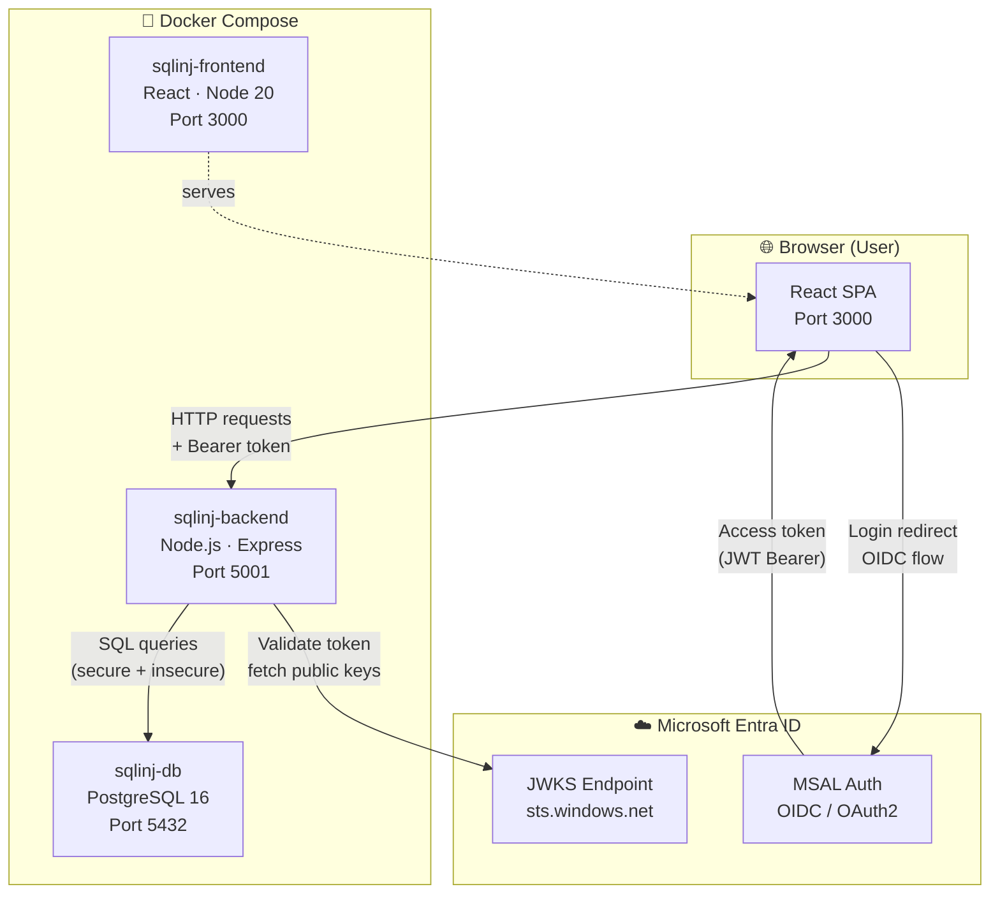
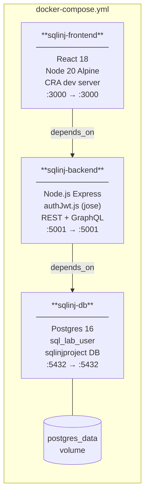
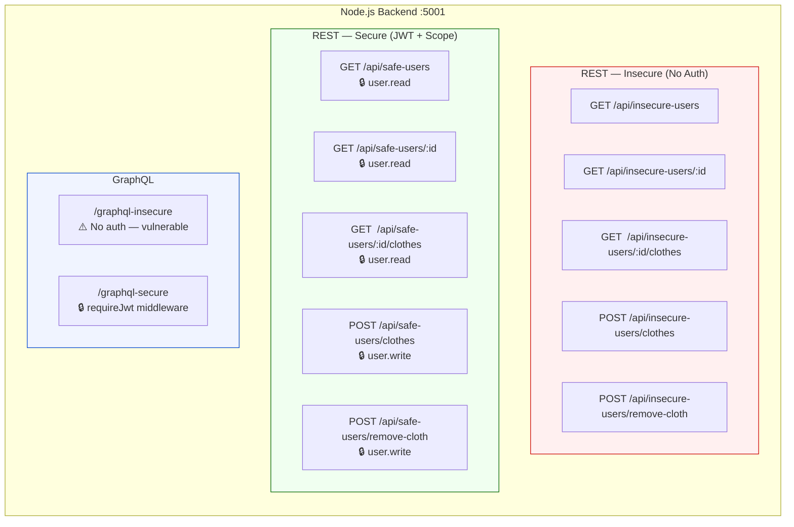
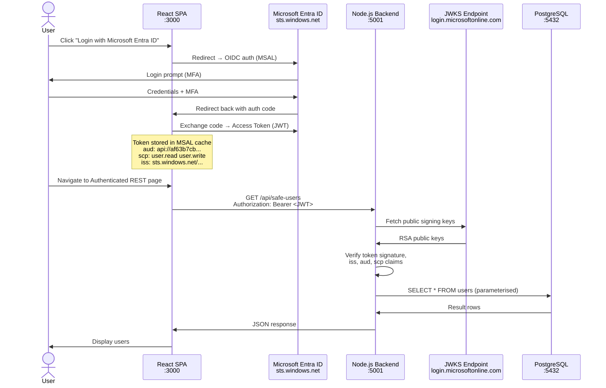
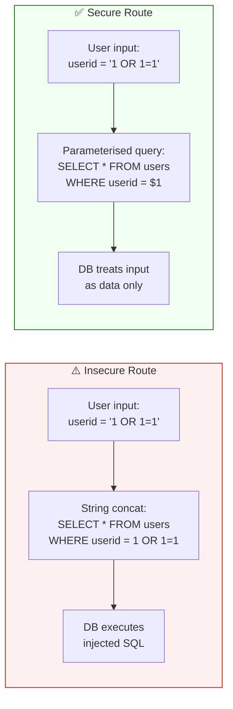
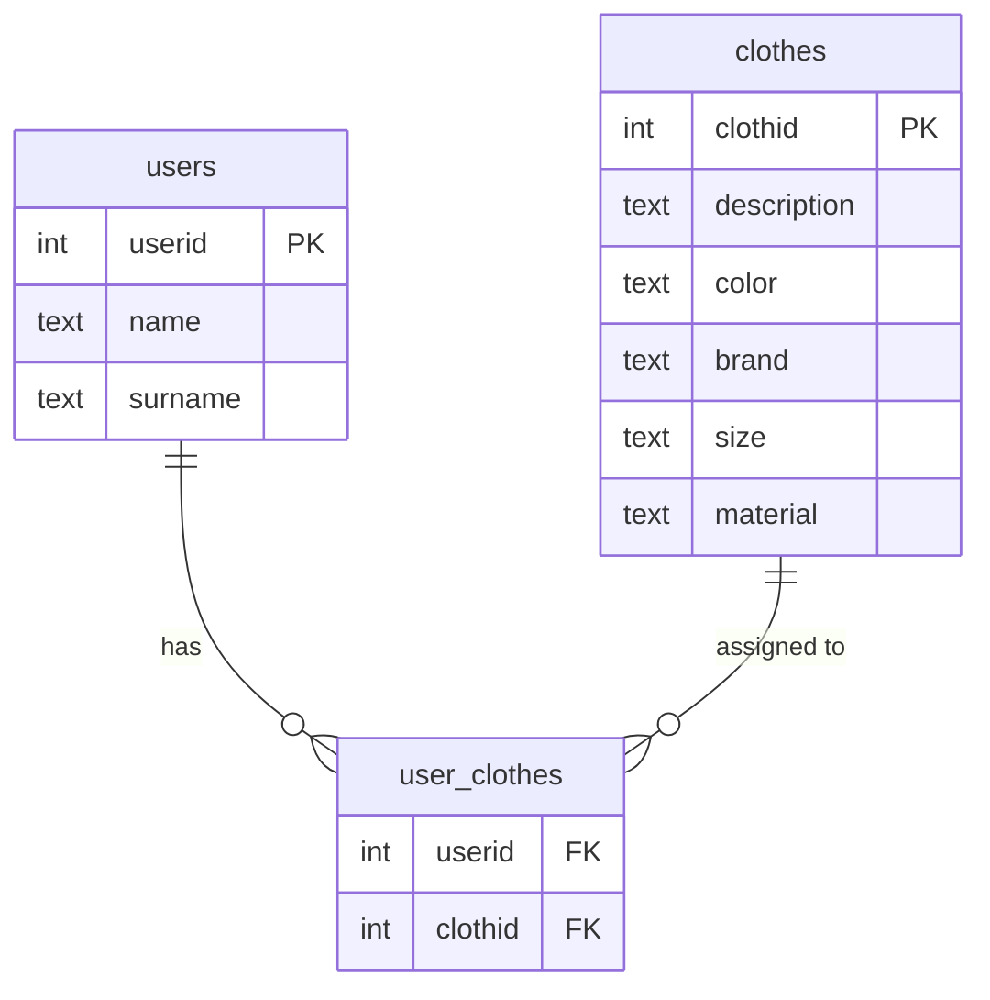
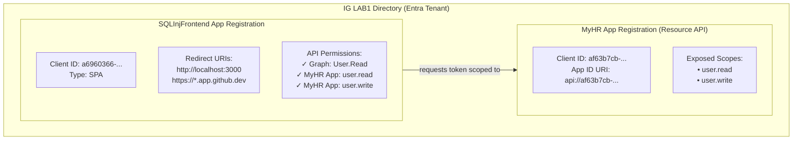
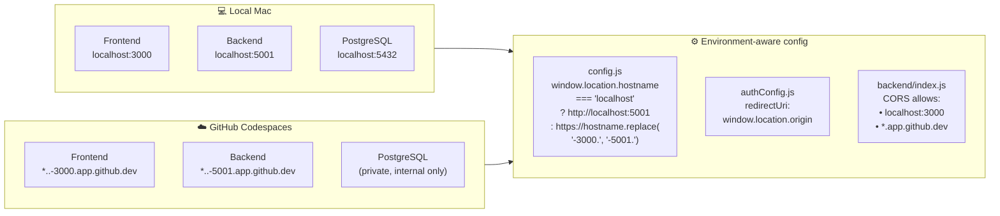

# SQLInjectionLab — Architecture & Design

> A containerised security learning lab demonstrating SQL injection vulnerabilities, secure vs insecure API patterns, and OAuth2/OIDC authentication with Microsoft Entra ID.

---

## Overview



---

## Container Architecture



---

## API Surface



---

## Authentication Flow



---

## SQL Injection: Vulnerable vs Secure



---

## Database Schema



---

## Entra ID App Registrations



---

## Environment Support



---

## Project Structure

```
SQLInjectionLab/
├── docker-compose.yml
├── .devcontainer/
│   └── devcontainer.json        # Codespaces port config
├── frontend/
│   ├── Dockerfile
│   ├── src/
│   │   ├── auth/
│   │   │   ├── authConfig.js    # MSAL config (dynamic redirectUri)
│   │   │   └── authHeaders.js   # Token acquisition helpers
│   │   ├── pages/
│   │   │   ├── InsecureUsersRESTPage.js     # ⚠️ No auth
│   │   │   ├── ListUsersRESTPage.js         # ⚠️ No auth
│   │   │   ├── ListUsersGraphQLPage.js      # ⚠️ No auth
│   │   │   ├── FetchUserClothesGraphQLPage  # ⚠️ No auth
│   │   │   ├── SecureUsersGraphQLPage.js    # 🔒 JWT required
│   │   │   └── SecureUserDetailsRESTPage.js # 🔒 JWT required
│   │   ├── apolloClient.js      # GraphQL insecure client
│   │   ├── authApolloClient.js  # GraphQL secure client (Bearer)
│   │   └── config.js            # Central API URL config
├── backend/
│   ├── Dockerfile
│   ├── .env                     # gitignored — secrets
│   ├── .env.example             # committed — template
│   ├── index.js                 # Express app + CORS
│   ├── authJwt.js               # JWT validation (jose + JWKS)
│   ├── insecureRoutes.js        # ⚠️ Vulnerable SQL (string concat)
│   ├── secureRoutes.js          # ✅ Parameterised queries
│   ├── insecureGraphQL.js       # ⚠️ Vulnerable GraphQL
│   ├── secureGraphQL.js         # ✅ Secure GraphQL
│   └── db.js                    # pg Pool connection
├── postgredb/
│   ├── init/01-init.sql         # Schema + seed data
│   └── dump.sql                 # Full DB dump for restore
└── DevSecOps/
    ├── Helm_Charts/             # EKS deployment charts
    └── Stacks/                  # CloudFormation / EKS stacks
```

---

## Security Learning Objectives

| Concept | Insecure Example | Secure Example |
|---|---|---|
| SQL Injection | `WHERE userid = ${userid}` | `WHERE userid = $1` (parameterised) |
| Authentication | No auth on insecure routes | JWT Bearer + scope validation |
| Authorisation | No scope checks | `requireScope("user.read")` |
| GraphQL | `/graphql-insecure` no auth | `/graphql-secure` + `requireJwt` |
| CORS | Open `cors()` | Origin allowlist |
| Secrets | Inline in code | `.env` (gitignored) |
| Token Validation | — | JWKS signature + iss + aud + scp |