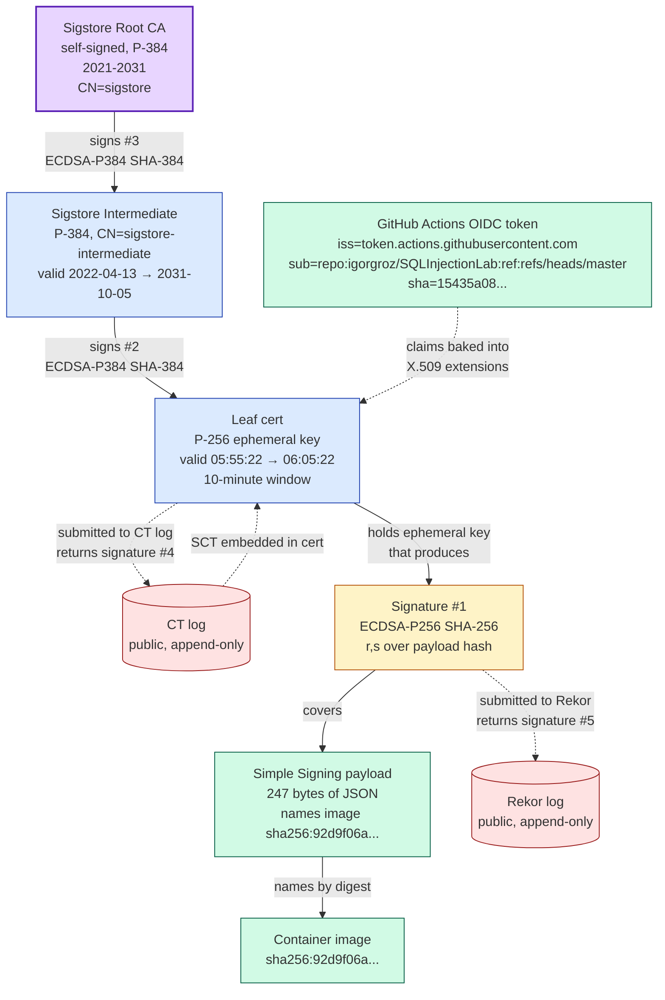
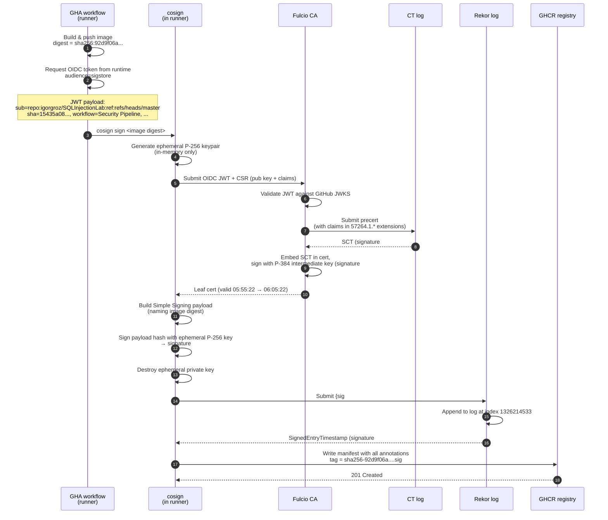
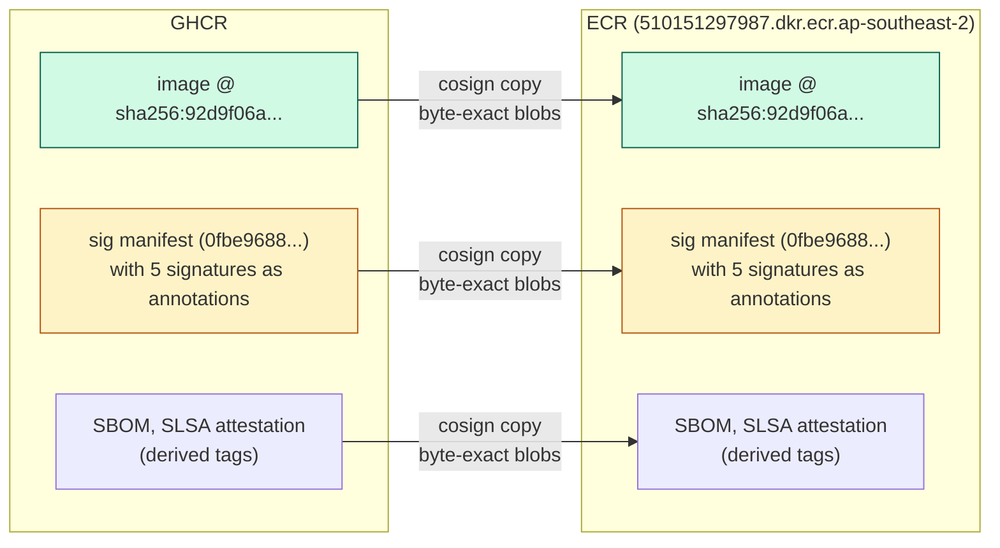
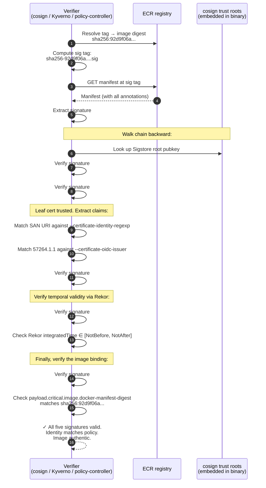

# Cosign Keyless Signing — Deep Dive

> A forensic walk-through of one signed container image artifact: what the five signatures are, where they live in the registry, what each one proves, how they chain together, and why the whole cryptographic edifice survives a byte-for-byte copy from GHCR to ECR.
>
> **Source artifact.** `ghcr.io/igorgroz/sqlinj-backend@sha256:92d9f06a666e694cac36cf894dc0455953abe8166480b4774b4a9e885e765360`, produced by workflow `Security Pipeline` at master HEAD `15435a0808e6f68b8bcf25e8c8a3633036fb10b5` on 2026-04-17. Raw inspection data (the manifest, cosign's decoded JSON, and the PEM-encoded Fulcio cert) is captured in [`zapoutput/cosign-inspect/`](zapoutput/cosign-inspect/). All numeric values and digests in this document are taken verbatim from those files.

---

## 1. Setting the scene

Supply-chain security for container images has three questions a verifier wants answered:

1. **Authenticity.** Was this exact image produced by a principal I trust?
2. **Integrity.** Has any bit of it been changed since?
3. **Provenance.** *How* was it built — which source commit, which workflow, which inputs?

Cosign keyless signing, backed by Sigstore (Fulcio + Rekor) and GitHub Actions OIDC, answers the first two directly and the third via a separate SLSA provenance attestation that travels alongside the signature. This document focuses on the signature half — the part that lives at the `.sig` sibling tag in the registry.

The central property worth building intuition for: **there is no long-lived signing key anywhere in this scheme.** A private key exists for under one second, inside the runner process, and is destroyed before the workflow step completes. The trust story is reconstructed at verification time from five independent signatures written to a public registry.

---

## 2. TL;DR — five signatures, one artifact

This one `.sig` artifact packages five distinct ECDSA signatures, each anchoring a different link in the chain:

| # | Signature                      | Algorithm            | What it signs                                           | Verified against                             |
|---|--------------------------------|----------------------|---------------------------------------------------------|----------------------------------------------|
| 1 | Cosign image signature         | ECDSA-P256 + SHA-256 | The Simple Signing payload (which names the image digest) | Fulcio leaf cert's public key                |
| 2 | Fulcio cert chain — leaf       | ECDSA-P384 + SHA-384 | The leaf cert (carrying the ephemeral key + OIDC claims) | Sigstore intermediate cert's public key      |
| 3 | Fulcio cert chain — intermediate | ECDSA-P384 + SHA-384 | The intermediate cert                                   | Sigstore root (hardcoded in cosign)          |
| 4 | CT Signed Certificate Timestamp | ECDSA-P256 + SHA-256 | The leaf pre-cert + issuance timestamp                  | CT log's public key (hardcoded in cosign)    |
| 5 | Rekor Signed Entry Timestamp   | ECDSA-P256 + SHA-256 | The log entry (sig + cert + integrated timestamp)       | Rekor's public key (hardcoded in cosign)     |

Two identity systems are bridged by these signatures: GitHub Actions OIDC claims (the JWT the runner holds) are projected one-for-one into X.509 extensions on the leaf cert, so everything a verifier needs to match against `--certificate-identity-regexp` is baked into the cryptographic chain. Two public append-only logs (Rekor and CT) anchor short-lived credentials to specific moments in time so the signatures outlive the ~10-minute cert validity window.

---

## 3. Where the signatures actually live in the registry

The UI at GHCR (and ECR) shows only digests and sizes for each descriptor, which can be misleading — it looks like there's no crypto in the artifact at all. The crypto lives inside the manifest JSON as **annotations on the layer descriptor**. Annotations are first-class OCI manifest fields but many registry UIs elide them.

```
Registry tag
  ghcr.io/igorgroz/sqlinj-backend:sha256-92d9f06a....sig
       │
       │  resolves to
       ▼
  Signature artifact manifest         [9882 bytes, digest 0fbe9688...]
  ├── config descriptor                [233 bytes, digest 13b7ab5f...]
  │     └─ stub OCI image config (near-empty JSON)
  │
  └── layers[]
      ├── layers[0] — Simple Signing payload
      │     │  mediaType: application/vnd.dev.cosign.simplesigning.v1+json
      │     │  size: 247   digest: 055942a5...
      │     │  content: JSON naming the signed image digest
      │     └── annotations:                      ◄── THE CRYPTO LIVES HERE
      │         dev.cosignproject.cosign/signature  (signature #1 — 71 bytes base64 DER)
      │         dev.sigstore.cosign/certificate    (leaf cert — carries sigs #2 and #4)
      │         dev.sigstore.cosign/chain          (intermediate + root — carries sig #3)
      │         dev.sigstore.cosign/bundle         (Rekor bundle — carries sig #5)
      │
      └── layers[1] — padding blob
            mediaType: application/octet-stream
            size: 233   digest: 13b7ab5f...    (same blob as config — stored once)
```

The thing tagged `.sig` is itself a full-fledged OCI image — config + layers — just with cosign-specific media types and crypto metadata stashed in annotations. The registry treats it as any other image; tooling that understands the Sigstore media type knows to read the annotations.

The tag `sha256-92d9f06a....sig` is **content-derived from the signed image's digest**, not the signature artifact's digest. This is the crucial portability property: any verifier that knows the image digest can compute the signature tag name mechanically, regardless of which registry the artifact lives in.

---

## 4. Chain of trust

All five signatures exist to transfer trust from Sigstore's hardcoded root down to a 247-byte JSON document that names one specific container image digest. Here's the full graph:



The purple nodes are trust anchors (Sigstore root, plus Rekor and CT log pubkeys — not shown but equally anchored) that cosign embeds in its binary. Everything else is reconstructed from the registry. No network calls to sigstore.dev at verification time.

---

## 5. Signature #1 — the cosign image signature

This is the signature the whole system exists to produce. Found in the manifest at `layers[0].annotations."dev.cosignproject.cosign/signature"`:

```
MEYCIQDt2MGp1jCBvNCZNJ8TrHkNKVVTxhOoqluUwKLMH73FYAIhAN5YPB3I2x0u9ZZH2+r9DYz5e4bXQZ4g6upIO9nU1/Px
```

71 base64 characters, decoding to 72 DER bytes. Parsed as DER:

```
30 46                                              SEQUENCE, length 0x46 (70 bytes)
   02 21 00 ED D8 C1 A9 D6 30 81 BC D0 99 34 9F    INTEGER (r, 32 bytes + 1 leading 00
         13 AC 79 0D 29 55 53 C6 13 A8 AA 5B 94    for DER signedness)
         C0 A2 CC 1F BD C5 60
   02 21 00 DE 58 3C 1D C8 DB 1D 2E F5 96 47 DB    INTEGER (s, 32 bytes + 1 leading 00)
         EA FD 0D 8C F9 7B 86 D7 41 9E 20 EA EA
         48 3B D9 D4 D7 F3 F1
```

That's the whole ECDSA signature — the `(r, s)` pair. 32 bytes each, consistent with the P-256 curve. No encryption primitive is involved despite the casual shorthand "signing = encrypt a hash" that works only for RSA PKCS#1-v1.5. For ECDSA on a 256-bit curve, signing derives `(r, s)` from the message hash, the private scalar `d`, and a per-signature random `k` via:

- `k` ← random in `[1, n-1]` (where `n` is the curve order)
- `r` ← x-coordinate of `k · G` mod `n` (where `G` is the curve generator)
- `s` ← `k⁻¹ · (H(m) + r · d)` mod `n`

Verification uses only the public point `Q = d · G` (no private `d`) via a parallel computation that checks `r ?= x((H(m)·s⁻¹)·G + (r·s⁻¹)·Q) mod n`. Verification is not decryption.

Two consequences are worth keeping in mind:

- **Signing the same message twice produces different signatures** (different `k` each time), so you cannot deduplicate cosign signatures by hash. Re-signing produces a new manifest digest.
- **If `k` ever repeats with the same key,** the private `d` drops out trivially — this is the PS3 / Sony breach (2010). It's why ephemeral keys are safer: one signature means `k` cannot repeat against something signed with the same key tomorrow.

**What the 71 bytes cover.** The ECDSA signature is over `SHA-256(payload)` where `payload` is the 247-byte `layers[0]` blob — a JSON document in Red Hat's Simple Signing format:

```json
{
  "critical": {
    "identity": { "docker-reference": "ghcr.io/igorgroz/sqlinj-backend" },
    "image":    { "docker-manifest-digest": "sha256:92d9f06a666e694cac36cf894dc0455953abe8166480b4774b4a9e885e765360" },
    "type": "cosign container image signature"
  },
  "optional": null
}
```

The signed image's digest appears **by value** inside this payload. That's the indirection that binds the signature to the image: the signature covers the payload, the payload names the image by digest, therefore changing the image (new digest → new payload → old signature no longer valid).

The hash of this 247-byte payload — `sha256:055942a562ed85eb78d4f425a31bd319fb0330db1fa54241c2845cfd87908b07` — is what appears inside the Rekor log entry (section 8) as the artifact hash. Everything ties together via content addresses.

**Verified with:** the public key inside the Fulcio leaf cert. The cert's `Subject Public Key Info` decodes to an uncompressed EC point starting `04:76:b3:4a:3e:8f:...`, a P-256 point. cosign extracts that point and runs the standard ECDSA verify.

---

## 6. Signatures #2 and #3 — the X.509 cert chain

These two signatures exist to attest that the public key in signature #1's verifying cert was authorized to speak on behalf of the claimed identity. They're standard X.509 chain signatures with a Sigstore-specific twist: the leaf cert carries GitHub's OIDC claims as X.509 extensions.

### Signature #2 — Fulcio intermediate signs the leaf

Found at the bottom of `fulcio-cert.pem` decoded:

```
Signature Algorithm: ecdsa-with-SHA384
Signature Value:
    30:66:02:31:00:86:10:8d:24:13:49:8e:f3:84:62:dd:ec:e1:
    72:1d:cb:cd:51:0a:07:1c:20:da:cc:f8:61:54:da:18:e4:c2:
    8a:52:58:ab:6b:2b:41:7f:e8:1f:0a:1c:4f:7f:0e:65:59:02:
    31:00:a1:a0:f7:c6:ff:59:72:78:11:80:97:91:a6:64:1f:63:
    3f:89:b7:99:4f:a3:7c:ff:5b:ba:9c:aa:b4:c7:5c:b9:bd:6b:
    44:43:7f:bd:55:b9:32:1d:08:45:a4:79:a4:57
```

Same DER shape as signature #1 — `30 66 02 31 00 ...02 31 00 ...` — but now `r` and `s` are **49 bytes each** (`0x31`), which is a tell for **P-384**. The intermediate CA uses a stronger curve than the leaf; algorithm strength (SHA-384) is matched to curve strength, as ECDSA best practice requires (hash size ≈ curve size).

What this signature covers is the TBSCertificate — all the cert fields *except* the signature itself. That includes:

- the leaf's public key (the verifying key for signature #1)
- the SAN URI (`https://github.com/igorgroz/SQLInjectionLab/.github/workflows/security-pipeline.yml@refs/heads/master`)
- every `1.3.6.1.4.1.57264.1.*` extension carrying OIDC claims (see section 9)
- the 10-minute validity window
- the SCT (signature #4) embedded in the precert

Any mutation of any byte in any of those fields breaks the signature. Which is exactly what you want — the identity claims and the public key are bound together by Fulcio's signature, meaning Fulcio is vouching "this public key represents this GitHub workflow identity for the next 10 minutes".

### Signature #3 — Sigstore root signs the intermediate

Found in `sig-decoded.json` at `Chain[0].Signature`. Self-signed root then appears as `Chain[1]` (its `Issuer == Subject`, which is the defining feature of a self-signed root).

The chain termination point — Sigstore's root CA public key — is **hardcoded in the cosign binary**. That's the single piece of trust a verifier has to establish once, by trusting the cosign distribution. Everything else walks back to it.

```
Hardcoded in cosign:
  Sigstore Root CA public key   (serial 4065443592980134080728682916587645234900384766)
                                CN=sigstore, O=sigstore.dev

  Rekor public key              (for verifying signature #5)
  CT log public key(s)          (for verifying signature #4)
```

These three constants are the verifier's only external trust roots. They're rotated via cosign releases, not network calls.

---

## 7. Signature #4 — the Signed Certificate Timestamp (SCT)

Often overlooked. Embedded directly inside the leaf cert as an X.509 extension (OID `1.3.6.1.4.1.11129.2.4.2`). Decoded:

```
CT Precertificate SCTs:
    Signed Certificate Timestamp:
        Version   : v1 (0x0)
        Log ID    : DD:3D:30:6A:C6:C7:11:32:63:19:1E:1C:99:67:37:02:
                    A2:4A:5E:B8:DE:3C:AD:FF:87:8A:72:80:2F:29:EE:8E
        Timestamp : Apr 17 05:55:22.309 2026 GMT
        Extensions: none
        Signature : ecdsa-with-SHA256
                    30:45:02:21:00:E9:EE:CF:70:39:60:7C:91:74:B2:92:
                    3B:11:21:E5:8E:DE:B8:95:BD:07:AD:A3:D0:9F:AE:D3:
                    70:81:54:EA:FC:02:20:1E:52:EB:A9:B5:2F:ED:8C:1D:
                    65:03:E4:AF:F8:DA:6C:E7:0B:57:FF:8F:91:6A:B4:01:
                    77:B1:CE:BC:28:74:74
```

**What's happening here.** Fulcio does not issue a cert and walk away. Before it finalizes the cert, it builds a **pre-certificate** (same structure, poison extension marking it non-useable), submits the pre-cert to Sigstore's public Certificate Transparency log, and receives back an **SCT** — a signed timestamped receipt saying "log operator DD:3D:30:6A:... saw this pre-cert at 2026-04-17 05:55:22.309 UTC and promises to include it in the append-only Merkle tree". Fulcio then embeds the SCT into the final cert and hands it back to cosign.

**Why this matters.** CT is the mechanism that was built for the TLS/web-PKI world (RFC 6962) to detect misbehaving CAs after DigiNotar, Symantec, and others demonstrated that private-PKI compromise is a real threat. Sigstore applies the same pattern: if Fulcio were ever compromised or tricked into issuing a cert under a wrong OIDC identity (e.g., claiming `sub=repo:microsoft/vscode` with a key the attacker holds), that cert would be detectable in the public log. Verifiers that require SCTs (cosign does) will reject certs that weren't publicly logged. It's a transparency requirement, not a liveness requirement — the verifier doesn't need to contact the CT log at verification time; the SCT itself is offline-verifiable against the log's hardcoded public key.

**Verified with:** CT log pubkey (embedded in cosign, keyed by `Log ID` = SHA-256 of the log's pubkey).

---

## 8. Signature #5 — the Rekor Signed Entry Timestamp

Found in `sig-decoded.json` at `Bundle.SignedEntryTimestamp`:

```
MEQCIDk0s+BVdBAHQateLMJ0o+00KG/pkVhU96DM6VhxnfSDAiBjHTI/jeuxRbFt5+T+3mzc5AMz87vL+2s+mXb7k2z/1A==
```

DER-encoded ECDSA again, this time signed by **Rekor's** key — not Fulcio's, not the leaf's. It covers the entire Rekor log entry:

```
Bundle.Payload:
  body:            <base64-encoded hashedrekord JSON with:
                    - hash of the 247-byte Simple Signing payload
                    - signature #1 echoed by value
                    - leaf cert echoed by value>
  integratedTime:  1776405322            ← Unix seconds
  logIndex:        1326214533            ← Rekor's monotonic counter
  logID:           c0d23d6ad406973f9559f3ba2d1ca01f84147d8ffc5b8445c224f98b9591801d
                                          ← SHA-256 of Rekor's public key
```

`integratedTime = 1776405322` converts to **2026-04-17 05:55:22 UTC** — *inside* the leaf cert's 10-minute validity window (`NotBefore 05:55:22` / `NotAfter 06:05:22`).

**Why this is the keystone signature.** Fulcio certs live for 10 minutes. In 2028, when someone tries to verify this image, the leaf cert has been expired for ~18 months. Naive cert chain validation would fail (`NotAfter` is in the past). The Rekor SET rescues this:

> Rekor has signed an attestation that at integratedTime T, it logged this signature using this cert. T falls inside the cert's validity window. The Rekor log is append-only; tampering with historical entries would require forging Rekor's private key. Therefore at time T, the cert was live and the signature was valid — which is all we need.

This is structurally identical to **RFC 3161 timestamping**: anchor a short-lived credential's validity to a specific moment via a trusted append-only authority, so the credential's verification outlives its key's useful life.

**Verified with:** Rekor's public key, hardcoded in cosign (identified by `logID`).

**Bonus nesting.** The `Bundle.Payload.body` field, when base64-decoded, contains Rekor's own internal representation of the log entry — which **includes signature #1 and the leaf cert embedded by value**. This nesting is intentional: the bundle is designed to be self-contained so that offline verification needs nothing beyond cosign's embedded trust roots and the bundle itself.

---

## 9. OIDC claims projected into X.509 extensions

This is the most elegant piece of the whole design. The GitHub Actions OIDC token (a JWT) that the runner held for ~10 minutes has its entire payload baked into the leaf cert as X.509 extensions. From that point forward, the ephemeral JWT can be forgotten; the cert carries every claim a verifier might want to match against.

Sigstore registered IANA Private Enterprise Number **57264** for this purpose. Each OIDC claim gets its own OID under `1.3.6.1.4.1.57264.1.*`:

| OID | Claim | Value (from this artifact)                                                                  |
|-----|-------|----------------------------------------------------------------------------------------------|
| SAN URI (critical) | identity | `https://github.com/igorgroz/SQLInjectionLab/.github/workflows/security-pipeline.yml@refs/heads/master` |
| 57264.1.1 | OIDC issuer | `https://token.actions.githubusercontent.com` |
| 57264.1.2 | event name | `push` |
| 57264.1.3 | source SHA | `15435a0808e6f68b8bcf25e8c8a3633036fb10b5` |
| 57264.1.4 | workflow name | `Security Pipeline` |
| 57264.1.5 | source repository | `igorgroz/SQLInjectionLab` |
| 57264.1.6 | source ref | `refs/heads/master` |
| 57264.1.8 | issuer URI (v2) | `https://token.actions.githubusercontent.com` |
| 57264.1.9 | build config URI | `...workflows/security-pipeline.yml@refs/heads/master` |
| 57264.1.10 | build config digest | `15435a0808e6f68b8bcf25e8c8a3633036fb10b5` |
| 57264.1.11 | runner environment | `github-hosted` |
| 57264.1.12 | source repository URI | `https://github.com/igorgroz/SQLInjectionLab` |
| 57264.1.13 | source repository digest | `15435a0808e6f68b8bcf25e8c8a3633036fb10b5` |
| 57264.1.14 | source repository ref | `refs/heads/master` |
| 57264.1.15 | source repository ID | `928699463` |
| 57264.1.16 | source repository owner URI | `https://github.com/igorgroz` |
| 57264.1.17 | source repository owner ID | `27270836` |
| 57264.1.18 | build config URI (v2) | `...workflows/security-pipeline.yml@refs/heads/master` |
| 57264.1.19 | build config digest (v2) | `15435a0808e6f68b8bcf25e8c8a3633036fb10b5` |
| 57264.1.20 | build trigger | `push` |
| 57264.1.21 | run invocation URI | `https://github.com/igorgroz/SQLInjectionLab/actions/runs/24550057825/attempts/1` |
| 57264.1.22 | source repository visibility | `public` |

The `1.1` through `1.6` OIDs are the legacy (v1) Sigstore extensions, retained for backward compatibility. The `1.8` through `1.22` range is the newer, more granular v2 schema that maps more closely to SLSA v1.0 provenance field names. Both are populated so any verifier works.

All of this is covered by **signature #2** (Fulcio's signature over the TBS cert), meaning the OIDC token's content is cryptographically bound to the ephemeral key. A verifier that validates signature #2 has authenticated the identity without ever seeing the JWT.

**Operational consequence.** Your verification command:

```bash
cosign verify \
  --certificate-identity-regexp '^https://github\.com/igorgroz/SQLInjectionLab/\.github/workflows/security-pipeline\.yml@refs/heads/master$' \
  --certificate-oidc-issuer 'https://token.actions.githubusercontent.com' \
  <image>
```

is matching literals against the SAN URI and 57264.1.1 extension. You can further pin on any other extension — common additions are `--certificate-github-workflow-sha` and `--certificate-github-workflow-repository` — to harden policy.

---

## 10. Timeline of the signing moment

The three wall-clock anchors from the artifact line up to within the same second:

| Event | Source | Timestamp |
|-------|--------|-----------|
| Fulcio cert `NotBefore` | `fulcio-cert-decoded.txt` | 2026-04-17 05:55:22Z |
| SCT timestamp | `fulcio-cert-decoded.txt` (CT ext) | 2026-04-17 05:55:22.309Z |
| Rekor `integratedTime` | `sig-decoded.json` | 1776405322 → 2026-04-17 05:55:22Z |
| Fulcio cert `NotAfter` | `fulcio-cert-decoded.txt` | 2026-04-17 06:05:22Z (+10 min) |

That alignment is not incidental — it's the entire sequence happening within sub-second bursts inside a GitHub Actions runner:



Total wall-clock window from "private key created" to "private key destroyed": well under a second. The signature artifact is then permanent and self-contained — all five signatures, the cert chain, the OIDC claims, and the timestamps live inside a single 9.8 KB manifest in the registry.

---

## 11. Why GHCR → ECR promotion preserves everything

The crucial insight is that **nothing in the crypto chain references the registry URL**. Every signature binds to content (digests, cert chain, log-entry contents), and every tag name is content-derived from the signed image digest. Copying the bytes from one registry to another therefore breaks no link.



Because `cosign copy` preserves blob bytes without re-compression:

- Image digest at ECR = `sha256:92d9f06a...` (unchanged).
- The derived tag `sha256-92d9f06a....sig` still resolves correctly at ECR.
- Signature manifest digest at ECR = `sha256:0fbe9688...` (unchanged — same bytes means same hash).
- Signatures #1–5 verify identically because none of them cover the registry URL.

The alternative approach — `docker pull && docker tag && docker push` — would move only the image manifest and its layer blobs, leaving the signature sibling tags behind. Worse, some Docker client / registry combinations re-compress layers, producing a different image digest at the destination, at which point the signature artifact (tagged at the *old* digest) is orphaned and useless. `cosign copy` is the only promotion path that preserves the signed artifact chain atomically.

---

## 12. Verification walk-through

When a verifier runs `cosign verify ...ecr...@sha256:92d9f06a...`, it reconstructs the trust chain in reverse. Every step is offline — no network call to Fulcio, Rekor, or the CT log:



Every line of that sequence can run on an air-gapped host given only the cosign binary and the image + signature bytes.

---

## 13. What this actually buys you (and doesn't)

### What it buys

- **Attacker-pushes-malicious-image-to-ECR attack is defeated.** If someone exfiltrates AWS credentials and pushes a malicious image tagged `main`, they cannot produce a matching `.sig` artifact because they can't obtain a Fulcio cert with `sub=repo:igorgroz/SQLInjectionLab:...`. An admission controller (Kyverno, policy-controller) running `cosign verify` at the cluster boundary will refuse the Pod.
- **No long-lived signing key to protect.** The ephemeral key exists for under a second. There is nothing to store in a KMS, nothing to rotate, nothing to revoke.
- **Fully offline verification.** Given cosign's embedded trust roots and the registry-resident artifact, a verifier needs zero connectivity to sigstore.dev or GitHub to validate an image.
- **Public audit trail.** Every signature this pipeline produces is visible to anyone with Rekor access — including monitoring tools that look for rogue issuances claiming to be from your repo.
- **Registry-portable.** Works unchanged across GHCR, ECR, Docker Hub, Harbor, Artifactory, etc., and survives copies between any of them.
- **Cluster-enforceable.** Kyverno, policy-controller, and sigstore-policy-controller all consume these signatures as admission policy input.

### What it doesn't buy

- **Build correctness.** Signature #1 proves a specific OIDC identity signed off on a specific image digest. It says nothing about *what the image contains*. A compromised workflow could build and sign a malicious image.
- **Provenance.** The SLSA provenance attestation (a separate `.att` artifact) is the companion that answers "built from which commit, which inputs, which workflow file". That attestation is signed by the same Fulcio cert chain and travels with the image.
- **Runtime behavior.** Nothing about this prevents a signed image from doing something malicious at runtime. That's a different defense layer (seccomp, AppArmor, network policies, runtime detection).
- **Secret rotation.** If GHA's OIDC signing key is compromised, the blast radius includes every Fulcio cert ever issued to GHA workflows. Rekor and CT provide detection but not prevention.

### The threat model one-liner

Before cosign: trust a registry URL + a tag. After cosign: trust *no registry*, trust *no URL*, trust only *content hashes + an identity that can be cryptographically verified offline against hardcoded roots*. That's a meaningfully smaller trust surface.

---

## 14. Inspection recipes

The exact commands used to produce the artifacts in [`zapoutput/cosign-inspect/`](zapoutput/cosign-inspect/):

```bash
# 1. Raw OCI manifest with all annotations intact
crane manifest \
  ghcr.io/igorgroz/sqlinj-backend:sha256-92d9f06a666e694cac36cf894dc0455953abe8166480b4774b4a9e885e765360.sig \
  | jq . > sig-manifest.json

# 2. Cosign's decoded view (base64 sig, full cert struct, expanded Rekor bundle)
cosign download signature \
  ghcr.io/igorgroz/sqlinj-backend@sha256:92d9f06a666e694cac36cf894dc0455953abe8166480b4774b4a9e885e765360 \
  | jq . > sig-decoded.json

# 3. Extract the Fulcio leaf cert as PEM and decode the X.509 fields
jq -r '.layers[0].annotations."dev.sigstore.cosign/certificate"' sig-manifest.json > fulcio-cert.pem
openssl x509 -in fulcio-cert.pem -text -noout > fulcio-cert-decoded.txt
```

Other useful commands when poking at a cosign artifact:

```bash
# Decode the Simple Signing payload (the 247 bytes that signature #1 covers)
jq -r '.Payload' sig-decoded.json | base64 -d | jq .

# Decode the Rekor hashedrekord body (nested self-containment)
jq -r '.Bundle.Payload.body' sig-decoded.json | base64 -d | jq .

# Decode the raw ECDSA signature to r/s bytes
jq -r '.Base64Signature' sig-decoded.json | base64 -d | xxd

# Extract a specific X.509 extension value by OID
openssl x509 -in fulcio-cert.pem -noout -ext subjectAltName,1.3.6.1.4.1.57264.1.3

# Full triangulate — show the sig, SBOM, and attestation tags for an image
cosign triangulate ghcr.io/igorgroz/sqlinj-backend@sha256:92d9f06a...

# Verify end-to-end (what an admission controller would do)
cosign verify \
  --certificate-identity-regexp '^https://github\.com/igorgroz/SQLInjectionLab/\.github/workflows/security-pipeline\.yml@refs/heads/master$' \
  --certificate-oidc-issuer 'https://token.actions.githubusercontent.com' \
  510151297987.dkr.ecr.ap-southeast-2.amazonaws.com/sqlinj-backend@sha256:92d9f06a...
```

---

## 15. References

- **Sigstore architecture**: https://docs.sigstore.dev/
- **Cosign spec (Simple Signing, OCI layout)**: https://github.com/sigstore/cosign/blob/main/specs/SIGNATURE_SPEC.md
- **Fulcio certificate profile (registered X.509 extensions)**: https://github.com/sigstore/fulcio/blob/main/docs/oid-info.md
- **Rekor transparency log**: https://docs.sigstore.dev/logging/overview/
- **RFC 6962 — Certificate Transparency**: https://datatracker.ietf.org/doc/html/rfc6962
- **RFC 3161 — Time-Stamp Protocol** (for the temporal-anchoring pattern): https://datatracker.ietf.org/doc/html/rfc3161
- **SLSA v1.0** (companion provenance framework): https://slsa.dev/spec/v1.0/
- **Red Hat Simple Signing payload format**: https://github.com/containers/image/blob/main/docs/containers-signature.5.md
- **GitHub Actions OIDC token claims**: https://docs.github.com/en/actions/deployment/security-hardening-your-deployments/about-security-hardening-with-openid-connect
- **Sigstore IANA PEN 57264**: https://www.iana.org/assignments/enterprise-numbers/?q=57264

---

## Appendix — glossary

| Term | Meaning |
|------|---------|
| OIDC | OpenID Connect — identity layer atop OAuth 2.0, here used as a JWT-based identity federation primitive. |
| JWT | JSON Web Token — signed JSON document, `header.payload.signature` base64url-encoded. |
| JWKS | JSON Web Key Set — the public keys an OIDC IdP publishes at `/.well-known/jwks.json`. Used for offline JWT validation. |
| Fulcio | Sigstore's short-lived CA. Validates OIDC tokens and issues 10-minute X.509 certs. |
| Rekor | Sigstore's public append-only transparency log for signatures. |
| SCT | Signed Certificate Timestamp (RFC 6962) — a CT log's signed promise to include a cert in its Merkle tree. |
| SET | Signed Entry Timestamp — Rekor's equivalent signed receipt for a log entry. |
| SLSA | Supply-chain Levels for Software Artifacts — OpenSSF provenance framework. Provenance attestations travel alongside cosign signatures as a separate `.att` artifact. |
| IRSA | IAM Roles for Service Accounts — AWS's workload identity federation for EKS pods. Uses the same OIDC-JWT-to-STS pattern as cosign→Fulcio. |
| Simple Signing | Red Hat's payload format for container signatures; a small JSON document naming the image by digest. |
| Ephemeral key | A private key that exists for seconds, is used once, and is destroyed. Central to Sigstore's threat model. |
| Content-addressable | Named by the hash of contents rather than by location. Both OCI manifests and Sigstore signatures rely on this for portability. |
| Transparency log | An append-only public log (Merkle-tree-based) whose entries can be proven present via inclusion proofs. Rekor and CT are both transparency logs serving different purposes. |
